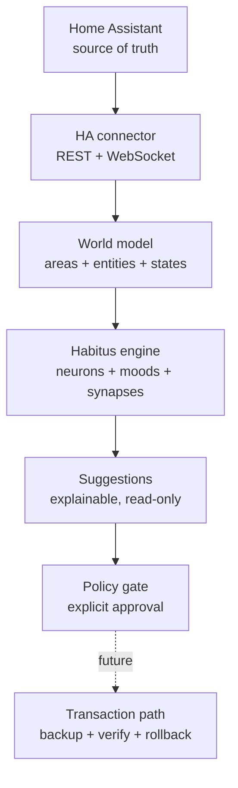

# PilotSuite

PilotSuite is the canonical, add-on-first implementation of the PilotSuite/Habitus architecture for Home Assistant.

> Current release: `0.1.0-alpha.1` — architecture generation v21.

PilotSuite observes Home Assistant, resolves entities into a semantic world model, calculates deterministic mood signals, and produces explainable suggestions. Home Assistant remains the source of truth for devices, entities, areas, labels, and live states. PilotSuite owns only additional semantics, policies, learning records, plans, and audit data.

The alpha is deliberately **read-only**. It can inspect and explain, but cannot call a Home Assistant service or alter configuration. The future write path is already defined as `plan -> backup -> apply -> verify -> rollback`; enabling it requires a later explicit release decision.

## Install in Home Assistant

1. Open **Settings -> Apps -> App store**.
2. Add `https://github.com/GreenhillEfka/pilotsuite` as a repository.
3. Install **PilotSuite**.
4. Start it and open the Web UI.

The repository is private. The GitHub repository must therefore be reachable by the Home Assistant app store before installation.

## v21 in one picture



The first bounded proving ground is the **Erdkeller Golden Zone**. Nothing is hard-coded to a specific entity ID; the zone is selected by Home Assistant area ID in the app options.

## Canonical project memory

- [`AI_CONTEXT.md`](AI_CONTEXT.md) — stable scope and non-negotiable rules
- [`CURRENT_STATE.md`](CURRENT_STATE.md) — what is really implemented now
- [`DECISIONS.md`](DECISIONS.md) — architecture decision log
- [`CHANGELOG.md`](CHANGELOG.md) — release history
- [`docs/ARCHITECTURE.md`](docs/ARCHITECTURE.md) — technical design
- [`docs/ROADMAP.md`](docs/ROADMAP.md) — staged delivery without feature sprawl

## Development

```bash
PYTHONPATH=pilotsuite python -m unittest discover -s pilotsuite/tests -v
docker build -t pilotsuite:dev pilotsuite
```

See [`docs/DEVELOPMENT.md`](docs/DEVELOPMENT.md) for local execution and testing.
