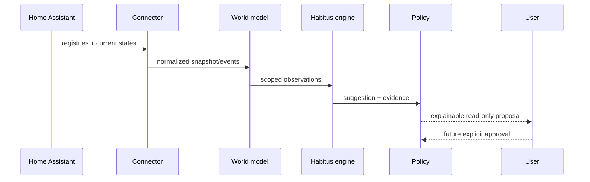
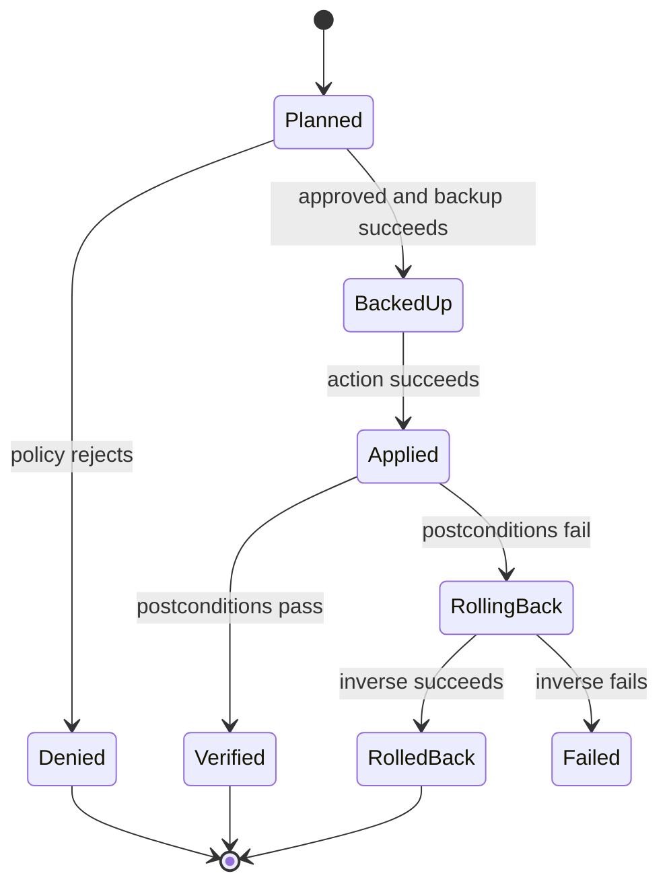

# Architecture v21

## Reviewed target and current implementation

`VISION.md` and ADR-009 through ADR-013 refine this architecture. There is one
modular add-on and optionally a thin native HA adapter, never two semantic owners.
`IMPLEMENTATION_STATUS.md` distinguishes current code from the target below.
SQLite is the single owner for zones, selections, bounded learning evidence,
feedback and history-import provenance; audit and dry-run plans remain JSONL.
Current climate rules are not habit learning. Action-specific recovery replaces any
universal rollback promise; no action execution exists in the read-only alpha.

Severity, evidence quality, statistical confidence, preference and risk are
separate concepts. Unknown confidence is null. Scope identity must not change
with the measurement. Read-only learning is implemented in bounded form and must be
accepted on a second unlike zone before any actuation milestone.

## Design goal

PilotSuite adds explainable context and governed suggestions to Home Assistant without becoming a second automation platform or a shadow source of truth.

## Runtime layers

| Layer | Owns | Must not own |
|---|---|---|
| Home Assistant connector | authenticated REST/WebSocket transport, reconnects, snapshots | business rules |
| World model | bounded current projection of registries and states | long-term copy of HA history |
| Resolver | areas, devices, entity membership, Golden Zone | hard-coded household entity IDs |
| Neurons | normalized observations and data-quality flags | action decisions |
| Moods | deterministic context scores plus evidence | direct service calls |
| Synapses | rules converting evidence into suggestions | final authorization |
| Policy engine | explicit allow/deny decisions and reasons | natural-language interpretation |
| Transaction engine | plan, backup, apply, verify, rollback | alternative mutation paths |
| API/UI | status, explanation, review, approval surface | hidden autonomy |
| AI gateway | optional summaries and proposals | policy bypass or raw credentials |

## Data flow



## Home Assistant projection

The connector loads:

- `config/area_registry/list`
- `config/device_registry/list`
- `config/entity_registry/list`
- `get_states`
- a `state_changed` subscription

The projection is memory-only and rebuilt after restart. Only PilotSuite-owned audit records and preferences are stored in `/data`.

## Habitus primitives

### Neuron

A normalized observation:

```json
{
  "entity_id": "sensor.example_humidity",
  "area_id": "erdkeller",
  "kind": "humidity",
  "value": 73.2,
  "quality": "good",
  "observed_at": "2026-09-22T18:00:00Z"
}
```

### Mood

A deterministic context score with evidence. Initial catalog: `stable`, `uncertainty`, `alert`, `humidity_high`, `humidity_low`, `temperature_low`, `temperature_high`, and `system_health`.

### Synapse

A versioned rule that links observations/moods to a suggestion. Every fired rule reports its identifier, thresholds, evidence, and confidence.

### Suggestion

A non-executing proposal with:

- stable ID and timestamp
- bounded scope
- evidence and explanation
- confidence and risk
- optional future action plan
- current policy decision

## Transaction boundary

The only valid future mutation state machine is:



In `0.1.0-alpha.1`, the transition from `Planned` to `BackedUp` is impossible by construction.

## Golden Zone acceptance criteria

The Erdkeller is accepted only when:

1. the configured Home Assistant area resolves uniquely;
2. all relevant temperature/humidity entities are discoverable without hard-coded IDs;
3. unavailable/unknown values are reported as uncertainty, never coerced to zero;
4. every mood and suggestion exposes evidence;
5. restart rebuilds the same world projection;
6. no Home Assistant mutation occurs;
7. logs and audit records contain no token or secret.
